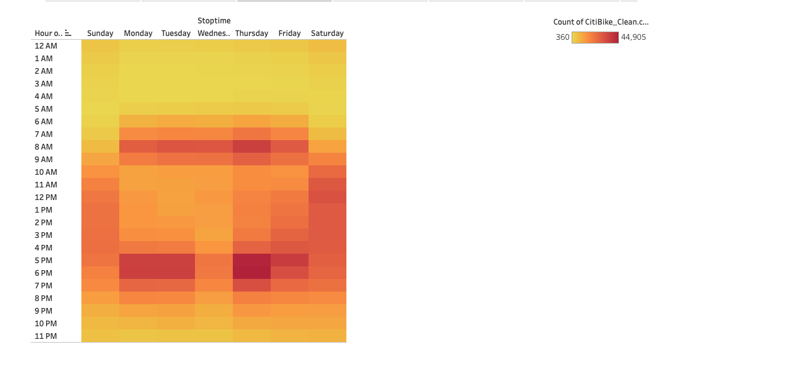

# NYC Bike Sharing Analyis

## Overview
A group of investors want to start up a new bikesharing service in Des Moines. They are tryingn to estimate how mant bikes will be needed to start up this service and whether or not this could be a successful venture for that area. We performed this analysis on the use trends for CitiBikes in NYC through Tableau  to get an idea of how popular the bikesharing service. 

## Results 
[link to dashboard](https://public.tableau.com/views/NYCCitiBikeChallenge_16562888967680/NYCChallenge?:language=en-US&:display_count=n&:origin=viz_share_link)

### Checkout Times
5 Minutes is the most popular checkout time. This tells us our riders are mostly using the bikesharing service for short trips. 

### Checkout Times by Gender
People who identify as males use the ridesharing service the most. 

### Trips/Hour
The highest concentration of trips per hour is on Thursday between 5 and 6 pm. This indicates many of those who operate on the normal 9-5pm schedule are utilizing the service the most. 

### Trips/Hour by Gender
The highest concentration for both males and females is also Thursday between 5-6pm. 

### User Trips by Gender by Weekday
Subscribers make up the largest group of users in both the male and female categories. Thursday and Friday remain the most popular use times among those subscribers. 

### Gender Breakdown
Males account for more than 65% of the trips, females account for roughly 25% of the trips, the Unkown gender category accounts for the rest. 

### August Peak Hours
5pm is the most popular start time in August across all of the trips. 
